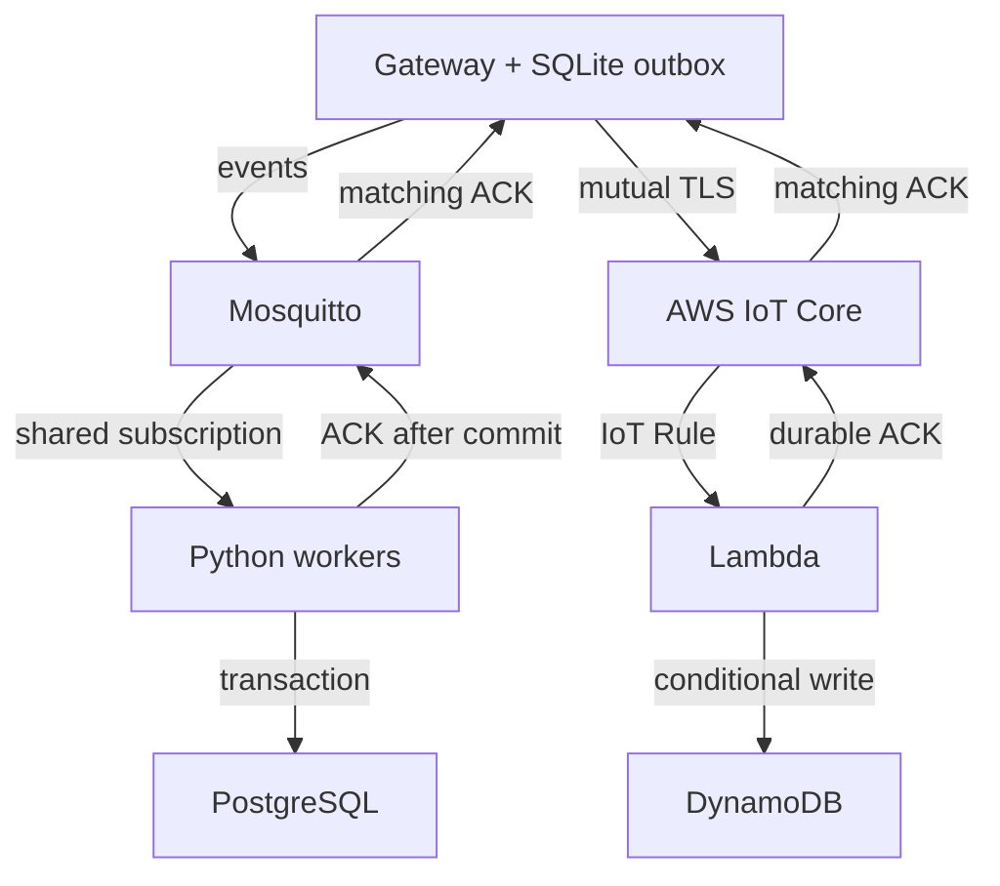

# Reliable telemetry ingestion

A C++20 Linux gateway stores synthetic sensor events in a SQLite outbox and
delivers them over MQTT. A Python backend acknowledges each event after durable
storage. Stable event identities and canonical SHA-256 fingerprints make retries
idempotent and distinguish conflicting data under the same identity.

The local backend uses PostgreSQL. An AWS adapter uses IoT Core, Lambda and
DynamoDB with the same event and acknowledgement contract.

## Build and test

On Ubuntu 24.04, as a normal user:

```sh
scripts/bootstrap_ubuntu.sh
env -u PYTHONPATH -u PYTHONHOME scripts/verify_local.sh
```

The bootstrap installs C++ and Python dependencies, Mosquitto and PostgreSQL 16.
The test runner starts its own services on ephemeral loopback ports and runs
host tests, MQTT/PostgreSQL fault scenarios, sanitizers and measurements.
Results go to ignored `results/`. Exit 77 identifies an environment limitation.
See [testing](docs/TESTING.md) for individual checks and their scope.

For a build and host tests only:

```sh
cmake -S . -B build -DCMAKE_BUILD_TYPE=RelWithDebInfo
cmake --build build -j2
ctest --test-dir build --output-on-failure
.venv/bin/python tests/cli_checks.py --gateway build/gateway
PYTHONPATH=ingestion .venv/bin/python -m unittest discover -s tests -p 'test_*.py'
```

Dependency and optional Compose image pins are in [versions.json](versions.json).

## Data path



See the [wire contract](docs/CONTRACT.md), [outbox policy](docs/OUTBOX.md),
[delivery loop](docs/DELIVERY.md) and [database queries](docs/DATABASE.md).

## Reliability model

- Acceptance is the SQLite transaction that stores an event and advances its
  sequence. Rejected input consumes no sequence; committed events survive restart.
- MQTT QoS 1 PUBACK confirms broker receipt. A matching application `stored` or
  `duplicate` ACK is required before deleting an outbox row.
- Backend records are immutable. Identical retries are duplicates; different data
  under an existing identity is a conflict. Terminal errors remain inspectable.
- Default outbox capacity is 4096 rows / 1 MiB payload, including terminal rows.
  Quarantine holds 64 rows. Application and transport windows are bounded;
  accepted records are never evicted automatically.
- Delivery is at least once. Eventual drain requires connectivity, backend
  availability, storage and retained deduplication identities. Delivery order and
  distributed exactly-once processing are not guaranteed.

SQLite uses WAL and FULL synchronization. Database-page and payload limits do not
bound the total filesystem footprint; WAL, indexes and external readers matter.
Use a filesystem quota for a hard disk cap. Process crash recovery and host power
loss are different failure modes.

## Local demo and diagnostics

With Docker Engine and Compose available:

```sh
python3 scripts/local_setup.py
docker compose up -d --build
.venv/bin/python scripts/run_demo.py --count 10
python3 scripts/telemetry_status.py status --db .runtime/sensor-a.db
docker compose down -v
```

Setup creates disposable credentials under `.runtime/`; the demo loads them
without printing them. Services bind loopback ports 18883/15432. Removing the
database volume ends deduplication retention.

The gateway supports `enqueue`, `run`, `status`, `new-stream` and terminal record
inspection. `run --replay FILE` accepts bounded measurement-only NDJSON and
allocates new identities; outbox retries preserve existing identities.
See the [operator runbook](docs/RUNBOOK.md) and
[measurement procedure](docs/MEASUREMENTS.md).

## AWS deployment

The SAM template defines scoped IoT policies, conditional DynamoDB writes, an
Errors alarm, an asynchronous Lambda failure destination and short log retention.
Cleanup checks the account, region, registered StackId and recorded resource
ownership before deleting the deployment.

A bounded deployment in `eu-central-1` exercised the AWS IoT Core → Lambda →
DynamoDB path with synthetic devices. The run covered mutual TLS, cross-device
topic isolation, conditional writes, application acknowledgements, Lambda failure
handling and resource teardown. See [live results](docs/results/aws-live.json),
[teardown results](docs/results/aws-teardown.json) and the
[AWS runbook](cloud/README.md).
